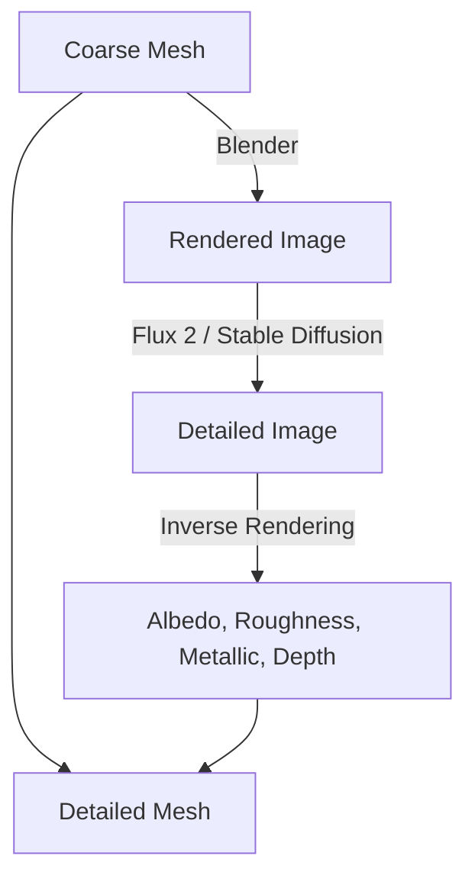
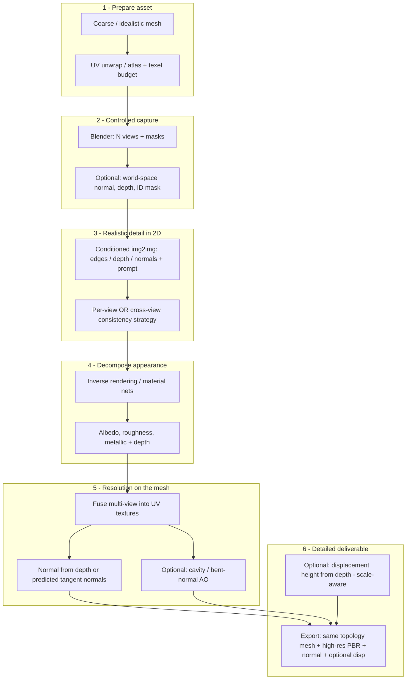

```mermaid
flowchart TD
	 A["Coarse Mesh"]
	 -->|Blender| B["Rendered Image"]
	 -->|Flux 2 / Stable Diffusion| C["Detailed Image"]
	 -->|Inverse Rendering| D["Albedo, Roughness, Metallic, Depth"]
	 
	 A & D --> E["Detailed Mesh"]
```

```mermaid
flowchart TD
  subgraph prep [1 - Prepare asset]
    M[Coarse / idealistic mesh]
    UV[UV unwrap / atlas + texel budget]
    M --> UV
  end

  subgraph render [2 - Controlled capture]
    BL[Blender: N views + masks]
    AUX[Optional: world-space normal, depth, ID mask]
    UV --> BL
    BL --> AUX
  end

  subgraph gen [3 - Realistic detail in 2D]
    COND[Conditioned img2img: edges / depth / normals + prompt]
    MV[Per-view OR cross-view consistency strategy]
    AUX --> COND
    COND --> MV
  end

  subgraph ir [4 - Decompose appearance]
    IR[Inverse rendering / material nets]
    MV --> IR
    IR --> PBR[Albedo, roughness, metallic + depth]
  end

  subgraph bake [5 - Resolution on the mesh]
    FUSE[Fuse multi-view into UV textures]
    NRM[Normal from depth or predicted tangent normals]
    AO[Optional: cavity / bent-normal AO]
    PBR --> FUSE
    FUSE --> NRM
    FUSE --> AO
  end

  subgraph out [6 - Detailed deliverable]
    DISP[Optional: displacement height from depth - scale-aware]
    OUT[Export: same topology mesh + high-res PBR + normal + optional disp]
    NRM --> OUT
    AO --> OUT
    DISP --> OUT
  end
```